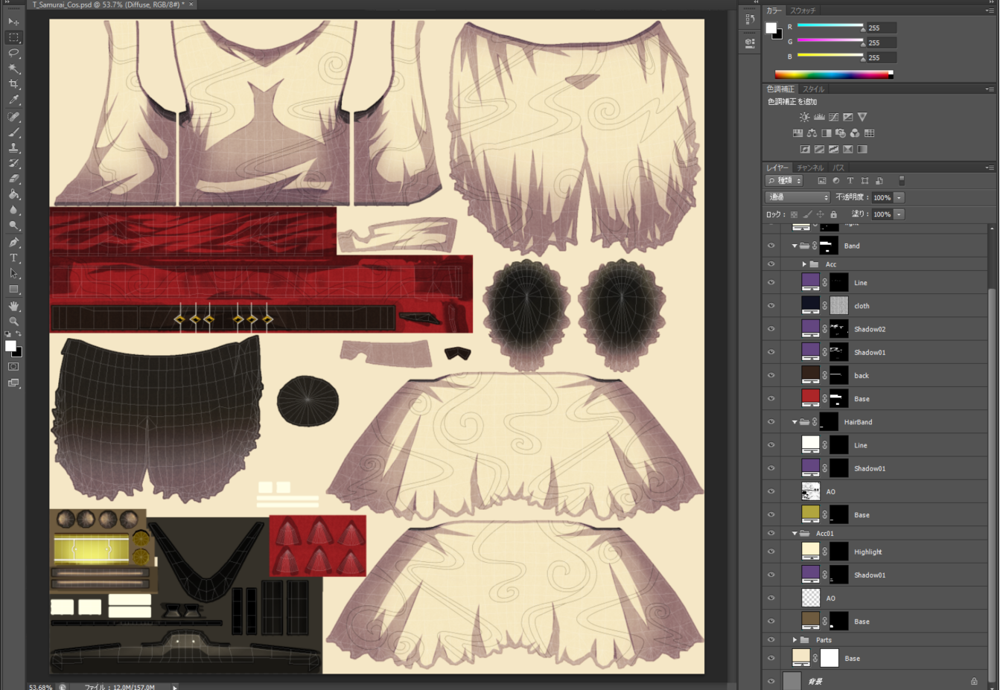
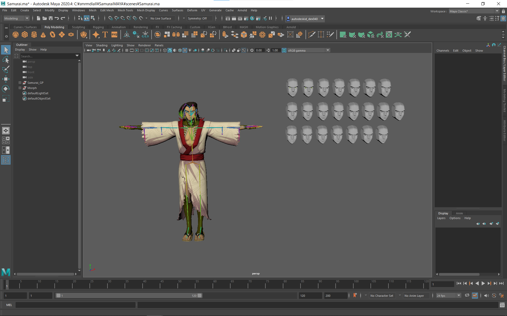
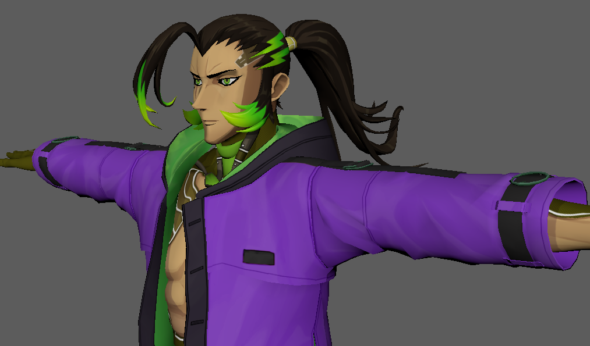
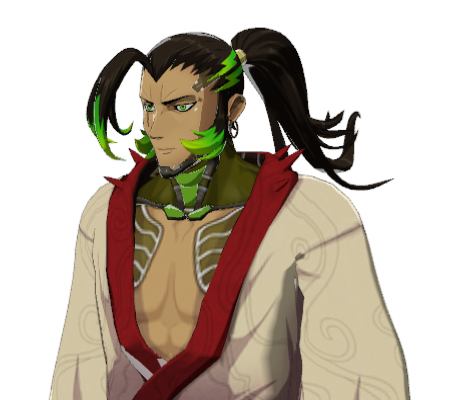
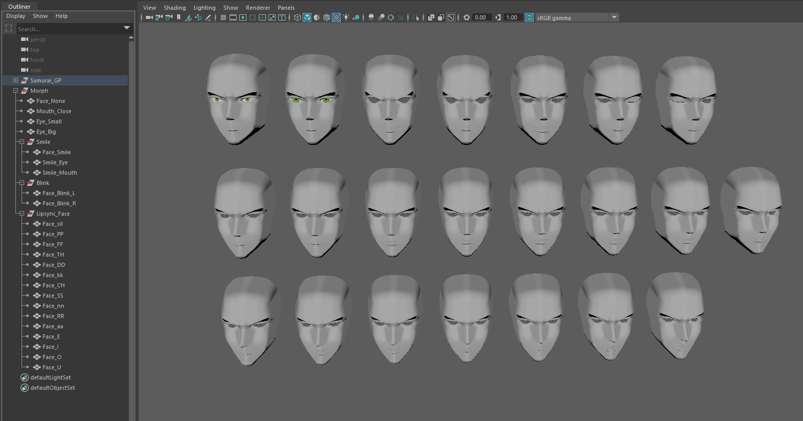

# How to modify an asset

This section is intended for corporate and professional creators to describe the limitations and cautions when modifying OASYX 3D Avatar, as well as specific dressing methods.

## Limitations of Modification

Please ensure that any modifications you make stay within the scope of basic usage restrictions.

- Mesh:
    - Recommended: 8 or fewer, Maximum: 16 or fewer

- Polygon Count:
    - Recommended: 32,000 or fewer, Maximum: 70,000 or fewer

- UV:
    - Avoid overlapping UV shells, consider the number of textures and materials used
    - Avoid overlapping UV shells, consider the number of textures and materials used

- Textures:
    - Number: Recommended: 8 or fewer, Maximum: 16 or fewer
    - Size: Recommended: 2048x2048, Maximum: 4096x4096

- Material Adjustments:
    - Number of materials: Recommended: 8 or fewer, Maximum: 16 or fewer
    - When using VRM, adjust using the MToon shader

- Facial:
    - Designed for VRM (includes "Neutral," "A," "I," "U," "E," "O," "Blink," "Joy," "Angry," "Sorrow")

- Bones:
    - Number of joints: Recommended: 128 or fewer, Maximum: 200 or fewer
    - Cover the required joints of Unity Humanoid

- Skinning:
    - Influences: 4 (fixed)
    - Use Classic Linear skinning

- Rigging:
    - Use HumanIK

- VRM Specifications:
    - Use VRM 0.x
    - Use UniVRM 6.1.1 or later
    - Use MToon shader

## About Production

### Tools and Software Required for Product

- Tools:
    - UniVRM6.1.1～
- Software:
    - Unity
    - Autodesk Maya

### Setup - Basic Production Procedures

**Step.1　Add models and make adjustments in Maya**

When you want to make changes or add parts to a model that is being distributed, you basically use Maya to make the changes.
*Specific examples of Maya operations are described in "[How to change avatars and the steps involved](#how-to-change-avatars-and-the-steps-involved)".

You may make changes without Maya operation if the following conditions are met.

1. Cases where you want to change the color of a specific part

→ Perform the operation on the PSD file, output the texture, and replace it with the existing file*

*Refer to "[How to create textures](#Points-to-note-about-production)" for operations on PSD files.

  2. Cases where items can be fixed in position relative to a specific joint

→ For example, glasses can be fixed to the head joint.

Set the item as a child of the head joint in Unity and adjust the position.

**Step.2 Create a texture in Photoshop**

When adding items, you must expand the UVs of the additional items and prepare textures to match. To change the color of an existing part, simply change the fill color of the corresponding layer in the PSD file. For textures, existing parts are textured using fill layers and masks so that the color can be changed for each part*

*Refer to "[How to create textures](#Points-to-note-about-production)" for details.

**Step.3 Import into Unity and set up shaders and VRM**

The required operations vary depending on what you want to do.

**Case 1. if the character model itself is changed using Maya**

→ The character must be replaced in Unity*

*Adding parts also falls under this category if the character's joints have skin weights.

**Case 2: When you want to attach a part to a character using the settings in Unity**

→ Import the part you want to add in Unity and attach it to the character's joints.

**Case 3: If you want to change the color of an existing part**

→ Replace the texture with a color-changed one.

**Case 4: To add or change VRM's shaking object settings**

→ Refer to "[How to set up a shaking object](#Points-to-note-about-production)".

**Case5. if you want to add or change BlendShape**

→ Refer to "[BlendShape and Lip Sync Instructions and Usage](#blendShape-and-lip-sync-instructions-and-usage)".

**Case 6: If you want to change or adjust the material**

→ Please refer to "[MToon Description and Usage](#mtoon-description-and-usage)".

Shaders other than MToon can be used, but please note that if you use a shader that is not compatible with VRM0.x, it will automatically change to the standard "glTF (GL Transmission Format)" material when output.

**Step.4 Output in VRM and check on various platforms**

After adjustment on Unity, output VRM files using VRM0.x series.
Import the output VRM file according to the manuals for each platform, and confirm that the adjustments you assumed are reflected.

### Points to note about production

**Note 1: How to create textures**

1. Do not draw textures directly

In order to change the color of each part in detail, texture is not directly drawn, but is drawn in the form of a mask on a fill layer.

2. Create shadows in the same way and multiply them

Shadows are not directly drawn, but are drawn in the form of a mask on a fill layer. By adjusting the color of the shadow fill layer, you can easily change the taste of the shadow, and by having separate shadow layers, only the color will change naturally when you change the fill color of each part.

**Note 2. How to set up a shaking object**

1. The settings for swaying objects are made in "VRM SpringBone" in order to support VRM.

For items that require swaying, create joints for swaying and set skin weights in advance. At this time, if the item requires skin weight to be allocated to the body joints as well, it is better to set the joints for swaying as children of the body joints. If the item is not affected by the body joint, it can be created independently. Set up the original joint for swaying and the joint for swaying, respectively. Set the original joint for swaying and the joint for swaying, respectively.

2. Import the model into Unity and set up "VRM SpringBone" after the joints and skinning for swaying are finished.

If the item is not directly added to the body, attach the item to the corresponding joint of the character.

**Note 3: About the normal lines of the face**

1. Facial shadows are more nicely cast if the normals are adjusted.

When shaping a face, it is necessary to create a face that matches the shading of the cartoon style, but if this is the only way to achieve this, the shadows may be cast in an unpleasant way that is closer to realism. To avoid this as much as possible, it is effective to edit the vertex normals of the face.

2. Create a face model with ideal shadow cast for transfer.

Since it is very time-consuming to adjust the normals for each vertex, and the results are likely to vary, the transfer function is used to adjust the normals. To prepare for this, create a face model with the ideal shadow cast. Adjust the model to create a flat surface so that shadows are cast in an animated style, mainly from the cheeks to the mouth area.

3. Transfer to the vertex normals of the face

Once the face model with the ideal shading is created for transfer, transfer the vertex normals using Maya's functions. Once the transfer is complete, use a directional light or similar to check that the shadows are as expected.

## How to change avatars and the steps involved

Step.1 Read the file
Unzip the file in the distribution and load the Maya file.

**Step.2 Create or load the mesh you want to add**

To add parts to an avatar that is being distributed, create the mesh (model) you wish to add.
If you want to add a model that already exists, go to "File" and select "Import...", then select the model you want to add and add it.

**Step.3 Make sure the added parts are consistent with the existing parts.**

If the added parts interfere with existing parts, hide or delete the existing parts if they are unnecessary.

If you want the added parts to coexist with the existing parts, remove the interference by adjusting the position of the added parts, adjusting the interfering parts of the existing parts, and so on.

**Step.4 Skinning**

Once the position and condition are determined, assign weights to the appropriate joints.

**Step.5 Import into Unity and check (when outputting VRM)**

If you already have an imported project, update the existing FBX file and perform "Reimport".

If you are importing into a new project, please set the "Humanoid," "Material," and "BlendShape" settings after importing.

Also, if there is a "shaking object" setting, the "VRMSpringBone" setting is also required.

### BlendShape and Lip Sync Instructions and Usage

**About BlendShape**

VRM's BlendShape setting allows the use of "lip-sync" (lip-sync) to match the facial expression changes and voice spoken into the microphone provided by each platform.

**BlendShape for VRM**

Neutral, A, I, U, E, O, Blink, Joy, Angry, Sorrow
    

**About Lip Sync**

Lip sync is a function that uses the "A", "I", "U", "E", and "O" BlendShapes in VRM to reproduce mouth movements in response to audio picked up from the microphone.

How to use BlendShape and Lip Sync
To use BlendShapes and Lip Sync, you need to register them as BlendShapes in Maya.

**fter importing into Unity, configure for VRM**

Create and set the "VRM Blend Shape Proxy" module in the character's Prefab and "BlendShapeAvatar" as the reference.
For detailed instructions, please also refer to the "[Blend Shape Settings](https://vrm.dev/en/univrm/blendshape/univrm_blendshape)" section of the official VRM website.

### MToon Description and Usage

MToon is a standard VRM compliant shader.
It can output the contents of materials adjusted in Unity almost as they are for the corresponding platform.

**How to use MToon**

To use MToon, UniVRM must be imported into Unity.
If it has been imported, search for "MToon" in the shader selection tab of the Material you wish to use and configure it.
For specific instructions on how to set up "MToon," please also refer to the "[MToon](https://vrm.dev/en/univrm/shaders/shader_mtoon)" section of the official VRM website.

## Next Page
[Others](others.md)
