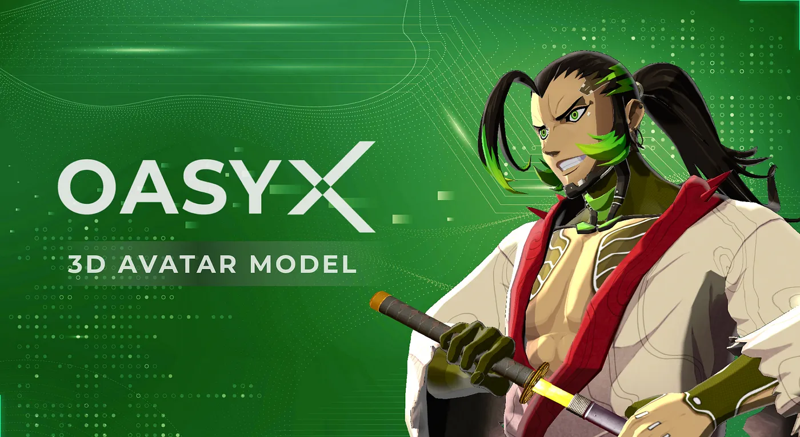

# Welcome to OASYX 3D Avatar

OASYX 3D Avatarのリポジトリへようこそ！  
OASYX 3D Avatarの基本的な仕様や特徴、利用方法だけでなく、クリエイター向けにOASYX 3D Avatarの改変方法についてなど、様々な情報を提供します。  
本ドキュメントは、主にOASYX 3D Avatarを活用したい企業やプロフェッショナルなクリエイターが対象です。  
OASYX 3D Avatarのアセットやドキュメントをオープンにすることで、ユーザー自身がOASYX 3D Avatarを楽しんでくれるだけでなく、世界中の企業やプロフェッショナルな個人がアセットの改変やバグ修正に貢献することでOASYXのエコシステム全体が発展していくことを望んでいます。

[README in English is here](readme.md)

# 目次

1. [Overview](#Overview)
    1. [OASYXとは](#OASYXとは)
    1. [アセットのダウンロード方法](#アセットのダウンロード方法)

1. [アセットの基本情報](#アセットの基本情報)
    1. [Yatagarasu 3D Avatar](#Yatagarasu-3D-Avatar)
    1. [基本仕様](#基本仕様)
    1. [出力ファイル](#出力ファイル)
    1. [動作確認済みプラットフォーム](#動作確認済みプラットフォーム)
    1. [プラットフォームの注意点](#プラットフォームの注意点)

1. [アセットの改変方法](アセットの改変方法.md)
    1. [改変仕様の制限範囲](アセットの改変方法.md#改変仕様の制限範囲)
    1. [制作について](アセットの改変方法.md#制作について)
        - [制作に必要なツールとソフトウェア](アセットの改変方法.md#制作に必要なツールとソフトウェア)
        - [セットアップ-制作の基本的な手順](アセットの改変方法.md#セットアップ-制作の基本的な手順)
        - [制作の注意点](アセットの改変方法.md#制作の注意点)
    1. [アバターの着せ替え方法と手順](アセットの改変方法.md#アバターの着せ替え方法と手順)
        - [BlendShapeとリップシンクの説明と使用方法](アセットの改変方法.md#BlendShapeとリップシンクの説明と使用方法)
        - [MToonの説明と使用方法](アセットの改変方法.md#MToonの説明と使用方法)

1. [その他](その他.md)
    1. [FAQ](その他.md#FAQ)
    1. [利用規約](その他.md#利用規約)
    1. [更新履歴](その他.md#更新履歴)

# Overview

## OASYXとは

OASYXは、ゲーミングブロックチェーン「Oasys」を象徴する、ゲーマー向けのNFTブランドの構築を目指すNFTプロジェクトです。

OASYXのNFTデザインは、サイバーパンクと日本の美学を融合させ、未来の世界を独自の表現として創り出しています。このNFTは、ネオンライト、ホログラフィックディスプレイ、機械などの先進技術を、洗練された日本のスタイルに取り入れています。また、侍などの伝統的な日本のシンボルやイメージもサイバーパンクの美学によって再解釈されています。

OASYXのNFTデザインは、単にサイバーパンクと日本の美学を披露するだけでなく、日本の精神性を反映しています。武士道や思いやりなどの日本の精神は、人種や性別に関係なく、共有されています。

OASYXプロジェクトの上記の部分は、ゲームブロックチェーンOasysを代表し、ゲーマーに対して独自のブランドを作り出すことを意図しています。このNFTのセットは、名だたるゲームプロデューサーである鈴木裕氏とのパートナーシップによって作成され、プロジェクトの本物さと興奮を高めています。

鈴木裕氏はシリーズ1の監督に任命されています。彼はかつてSEGAでゲームプロデューサーとして活躍し、バーチャファイターやシェンムーなど数々の名作を世に送り出しました。それらの作品は、OASYXの世界観に彼の経験が反映されています。

また、鈴木裕氏と並んで、多才な日本のデジタルアーティストであるGODTAILも参加しています。彼はさまざまなアニメテーマのアートワークやデザインを手掛けており、最近発表されたAU（OASYXの10人のPFPキャラクター）は彼の作品を基に生成されています。

## アセットのダウンロード方法

OASYX 3D Avatarのダウンロードは、公式サイトより行ってください。  
**OASYX公式サイト**: https://x.oasys.games/3dmodel

# アセットの基本情報

こちらのセクションは、ユーザー向けに公開したOASYX-Yatagarasu 3D Avatarの基本仕様や活用プラットフォーム等、基本的な情報について記載しています。

## Yatagarasu 3D Avatar

OASYX 3D Avatarのアセットは現在「Yatagarasu」のみ公開されています。

OASYX 3D Avatarのダウンロードは、公式サイトより行ってください。  
**OASYX公式サイト**: https://x.oasys.games/3dmodel

## 基本仕様

Yatagarasu 3D Avatarの基本仕様については以下の通りとなります。

- メッシュ ( 9 meshes )
    - Yatagarasu_Eye
    - Yatagarasu_Face
    - Yatagarasu_Head
    - Yatagarasu_Body ( BodySuites )
    - Yatagarasu_Body_cull ( Kimono )
    - Yatagarasu_Costume ( Kimono )
    - Yatagarasu_Hair
    - Yatagarasu_HairBand
    - Yatagarasu_Shoes

- ポリゴン数
    - 36266 Tris ( kimono )
    - 31622 Tris ( BodySuites )

- UV
    - No UDIM
    - No OverlapUVs

- テクスチャ ( 5 textures )
    - T_Yatagarasu_Body_BC ( 2048x2048 )
    - T_Yatagarasu_Costume_BC ( 2048x2048 )
    - T_Yatagarasu_Face_BC ( 2048x2048 )
    - T_Yatagarasu_Hair_BC ( 2048x2048 )
    - T_Yatagarasu_Shoes_BC ( 1024x1024 )

- マテリアル ( 5 materials )
    - M_Yatagarasu_Body
    - M_Yatagarasu_Costume
    - M_Yatagarasu_Face
    - M_Yatagarasu_Hair
    - M_Yatagarasu_Shoes

- フェイシャル
    - Smile
    - Blinc
    - Lipsync

- ボーン
    - 82 Joints
    - HumanIK Standard

- スキニング
    - Skinning method : Classic linear
    - 4 influences

- リギング
    - HumanIK Standard

- VRM仕様
    - UnityVersion : 2021.3.20f1 ( LTS )
    - VRMVersion : UniVRM 0.109.0
    - Shader : MToon

## 出力ファイル

- VRMファイル
- fbxファイル
- UnityPackage
- Maya ( ma )
- Blender ( BinaryFBX )

## 動作確認済みプラットフォーム

- Cluster
- VroidHub

## プラットフォームの注意点

「Cluster」のアバター無制限化等、制限は緩和傾向にあるため配布中のモデルや同等のポリゴン数やテクスチャ解像度のVRMファイルを使用することが可能な場合が多いです。  
ただし、プラットフォームによっては配布中のモデルが使用できない場合や内部的に自動で軽量化され、そのままの見た目が保証されない可能性があります。

## 次のページ
[アセットの改変方法](アセットの改変方法.md)

