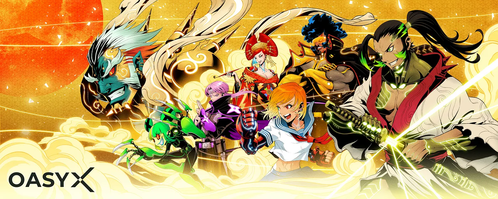
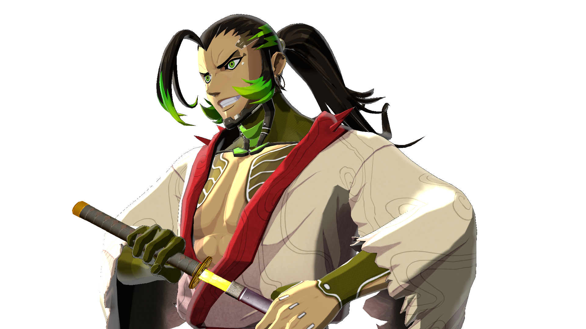

# Welcome to OASYX 3D Avatar

Welcome to the OASYX 3D Avatar repository!  
This section provides not only the basic specifications, features, and usage of OASYX 3D Avatar, but also various information for creators on how to modify OASYX 3D Avatar.
This document is mainly intended for companies and professional creators who want to utilize OASYX 3D Avatar.  
By opening up the OASYX 3D Avatar assets and documentation, we hope that not only the users themselves will enjoy using OASYX 3D Avatar, but also the entire OASYX ecosystem will grow as companies and professional individuals around the world contribute to modifying assets and fixing bugs. We hope that the OASYX ecosystem as a whole will continue to grow.

[日本語版READMEはこちら](readme-ja.md)

# Table of Contents

1. [Overview](#Overview)
    1. [What is OASYX?](#What-is-OASYX)
    2. [How to download assets](#How-to-download-assets)
2. [Basic information about assets](#Basic-information-about-assets)
    1. [Yatagarasu 3D Avatar](#Yatagarasu-3D-Avatar)
    2. [Basic specifications](#Basic-specifications)
    3. [Output files](#Output-files)
    4. [Tested platforms](#Tested-platforms)
    5. [Notes to the platform](#Notes-to-the-platform)
3. [How to modify an asset](how-to-modify-an-asset.md)
    1. [Limitations of Modification](how-to-modify-an-asset.md#Limitations-of-Modification)
    2. [About Production](how-to-modify-an-asset.md#About-Production)
        - [Tools and Software Required for Production](how-to-modify-an-asset.md#About-Production)
        - [Setup - Basic Production Procedures](how-to-modify-an-asset.md#Setup---Basic-Production-Procedures)
        - [Points to note about production](how-to-modify-an-asset.md#Points-to-note-about-production)
    3. [How to change avatars and the steps involved](how-to-modify-an-asset.md#How-to-change-avatars-and-the-steps-involved)
        - [BlendShape and Lip Sync Instructions and Usage](how-to-modify-an-asset.md#BlendShape-and-Lip-Sync-Instructions-and-Usage)
        - [MToon Description and Usage](how-to-modify-an-asset.md#MToon-Description-and-Usage)
4. [Others](others.md)
    1. [FAQ](others.md#FAQ)
    2. [Terms of service](others.md#Terms-of-service)
    3. [Update history](others.md#Update-history)

# Overview

## What is OASYX?

OASYX is an NFT project aimed at creating an NFT brand for gamers, symbolizing the Oasys gaming blockchain.

OASYX’s NFT design merges Cyberpunk with Japanese aesthetics to create a one-of-a-kind portrayal of a futuristic world. The NFT incorporates advanced technology such as neon lights, holographic displays, and machines into a sleek Japanese style. Traditional Japanese symbols and images, such as samurai, are also featured and reinterpreted in a cyberpunk aesthetic.

OASYX’s NFT design not only showcases Cyberpunk and Japanese aesthetics, but it also reflects the spirit of Japan. It portrays Japanese spirituality, such as Bushido and compassion, commonly shared by individuals of all races and genders.

The aforementioned parts of the project OASYX add up to representing the gaming blockchain Oasys and are intended to create a distinct brand for gamers. This set of NFTs was made in partnership with famed game producer Yu Suzuki, contributing to the project’s authenticity and excitement.

Yu Suzuki is appointed as a supervisor in the series 1. As a former game producer at SEGA, he has given the world numerous masterpieces such as Virtual Fighter and the Shenmoo series, reflecting his experience on the OASYX’s view of the world.

Alongside with Yu, GODTAIL who is a multi-talented Japanese digital artist behind various anime-themed artworks and designs. The recently unveiled AU, OASYX’s 10 PFP characters, are generated based on his artwork.

## How to download assets

Please download OASYX 3D Avatar from the official website.  
OASYX official website: https://x.oasys.games/

# Basic information about assets

This section contains basic information on OASYX-Yatagarasu 3D Avatar released for users, including basic specifications and platforms for use.

## Yatagarasu 3D Avatar

Currently, only the "Yatagarasu" asset is available for OASYX 3D Avatar.

Please download OASYX 3D Avatar from the official website.  
**OASYX official website**: [https://x.oasys.games/](https://x.oasys.games/)

## Basic specifications

The basic specifications for the Yatagarasu 3D Avatar are as follows:

- Mesh(9meshes ):
    - Yatagarasu_Eye
    - Yatagarasu_Face
    - Yatagarasu_Head
    - Yatagarasu_Body ( BodySuites )
    - Yatagarasu_Body_cull ( Kimono )
    - Yatagarasu_Costume ( Kimono )
    - Yatagarasu_Hair
    - Yatagarasu_HairBand
    - Yatagarasu_Shoes

- Polygon Count:
    - 36266 Tris ( kimono )
    - 31622 Tris ( BodySuites )

- UV:
    - No UDIM
    - No OverlapUVs

- Textures(5textures ):
    - T_Yatagarasu_Body_BC ( 2048x2048 )
    - T_Yatagarasu_Costume_BC ( 2048x2048 )
    - T_Yatagarasu_Face_BC ( 2048x2048 )
    - T_Yatagarasu_Hair_BC ( 2048x2048 )
    - T_Yatagarasu_Shoes_BC ( 1024x1024 )

- Material Adjustments (5materials):
    - M_Yatagarasu_Body
    - M_Yatagarasu_Costume
    - M_Yatagarasu_Face
    - M_Yatagarasu_Hair
    - M_Yatagarasu_Shoes

- Facial Features:
    - Smile
    - Blinc
    - Lipsync

- Bones:
    - 82 Joints
    - HumanIK Standard

- Skinning:
    - Skinning method : Classic linear
    - 4 influences

- Rigging:
    - HumanIK Standard

- VRM Specifications:
    - UnityVersion : 2021.3.20f1 ( LTS )
    - VRMVersion : UniVRM 0.109.0
    - Shader : MToon

## Output files

- VRMファイル
- fbxファイル
- UnityPackage
- Maya ( ma )
- Blender ( BinaryFBX )

## Tested platforms

- Cluster
- VroidHub

## Notes to the platform

In many cases, it is possible to use models currently being distributed or VRM files with equivalent polygon counts and texture resolutions, as restrictions are being eased, such as the unlimited avatars in the Cluster.

However, depending on the platform, there is a possibility that distributed models cannot be used, or that they are automatically lightened internally and their appearance may not be guaranteed.

## Next page

[How to modify an asset](how-to-modify-an-asset.md)
