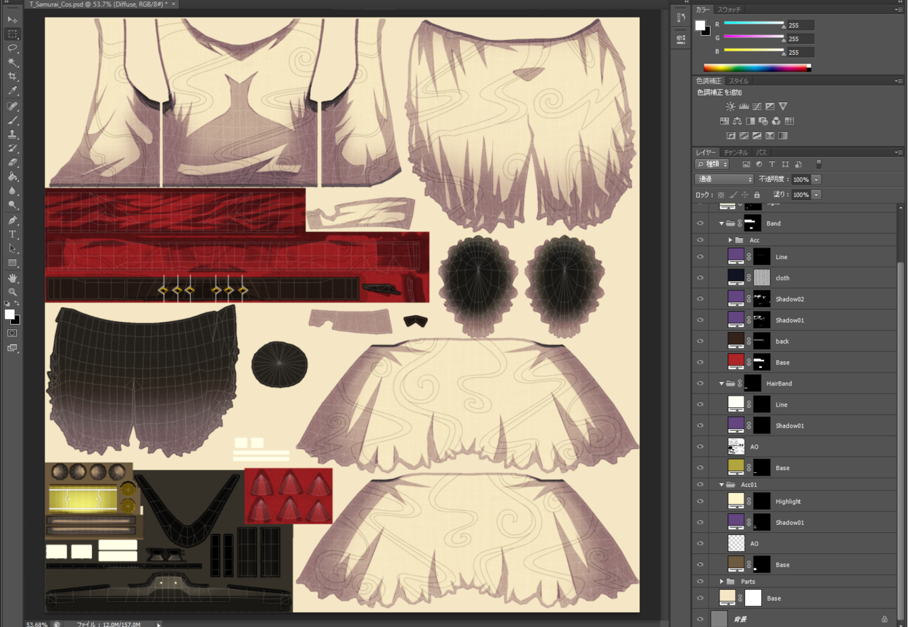
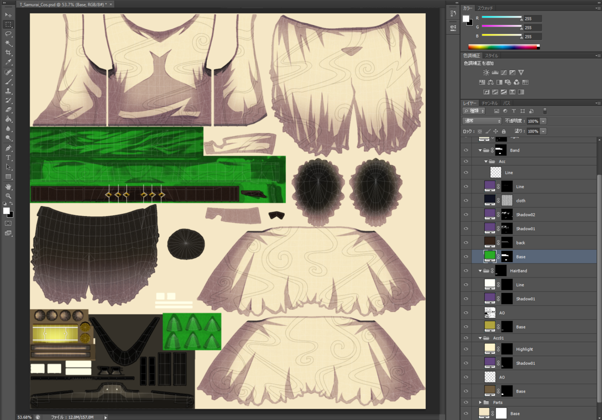
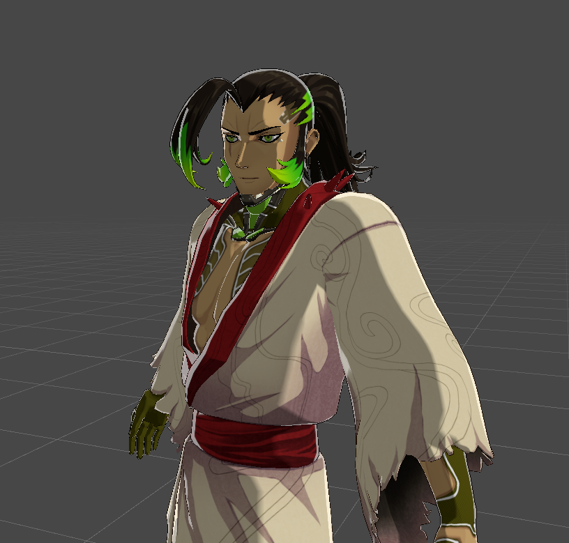
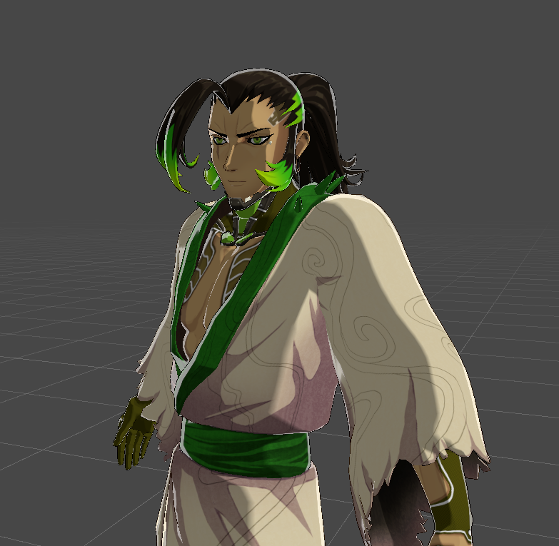
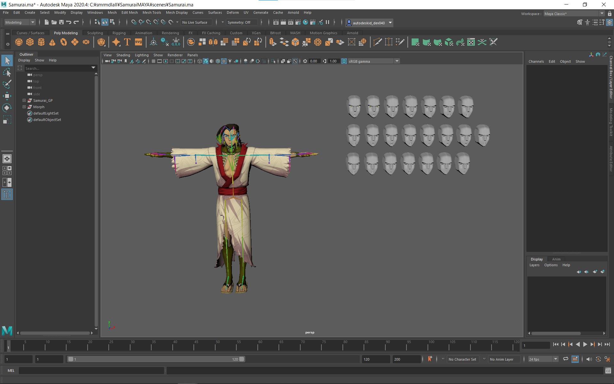
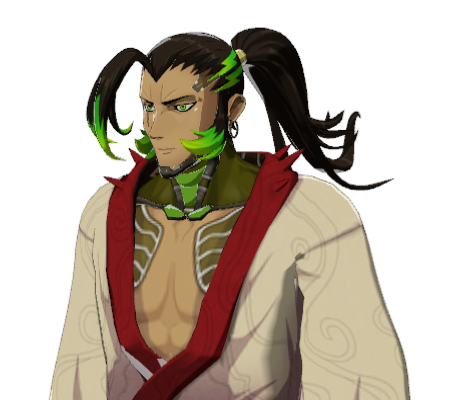
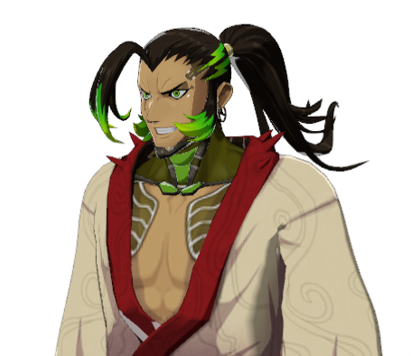
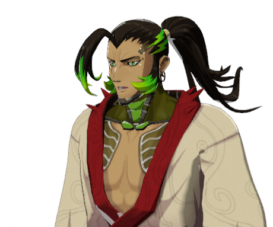
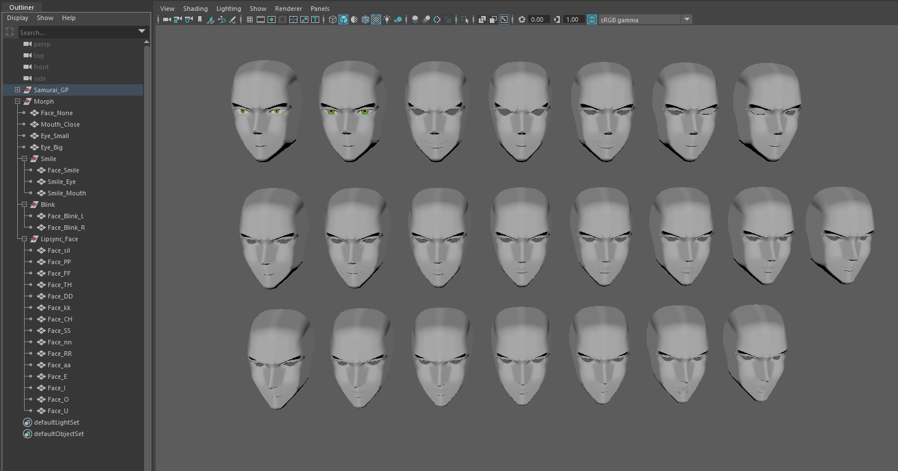
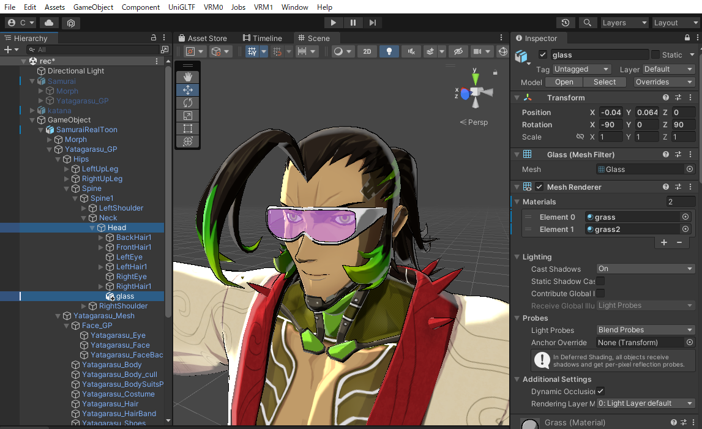

# アセットの改変方法

## このセクションについて
こちらのセクションは、企業やプロフェッショナルなクリエイター向けにOASYX 3D Avatarの改変時の制限範囲や注意点、具体的な着せ替え方法について記載しています。

## 改変仕様の制限範囲

改変を行う場合は基本使用の制限範囲に収めるようにしてください。

- メッシュ
    - 推奨8以下、最大16以下
- ポリゴン数
    - 推奨32000以下、最大70000以下
- UV
    - UVシェルは重ねない、テクスチャ枚数、マテリアル数を考慮する
- テクスチャ
    - 枚数：推奨8枚以下、最大16枚以下
    - サイズ：推奨2048x2048、最大4096x4096
- マテリアル調整
    - マテリアル数：推奨8以下、最大16以下
    - VRM使用時は、MToonシェーダーで調整する
- フェイシャル
    - VRM想定（「Neutral」「A」「I」「U」「E」「O」「Blink」「Joy」「Angry」「Sorrow」）
- ボーン
    - ジョイント数：推奨128以下、最大200以下
    - Unity Humanoidの必須ジョイントを網羅する
- スキニング
    - インフルエンス数：4（固定）
    - クラシックリニアを使用
- リギング
    - HumanIKを使用
- VRM仕様
    - VRM0.xを使用
    - UniVRM6.1.1～を使用
    - MToonを使用

## 制作について

### 制作に必要なツールとソフトウェア

- ツール
  - UniVRM6.1.1～

- ソフトウェア
  - Unity
  - Autodesk Maya

### 制作の基本的な手順（セットアップ）

- Step.1　Mayaでモデル追加や調整を行う

  配布中のモデルに変更を加えたり、パーツを追加したい場合  
  基本的にはMayaを使用して変更を行っていきます。  
  ※Mayaでの操作については「[アバターの着せ替え方法と手順](#アバターの着せ替え方法と手順)」で具体的な制作例を記載しています。

  次の条件を満たす場合は、Mayaの操作無しでも変更を行う事ができます。
  1. 特定の箇所の色を変えたいだけの場合  
  → PSDファイルに操作を行い、テクスチャを出力し既存のファイルと入れ替える  
  ※PSDファイルに行う操作については「テクスチャの作成方法」を参照

  1. 特定のジョイントからの相対位置にアイテムを固定できる場合  
  → 例えば眼鏡のように、ヘッドのジョイントに固定できるような場合  
  Unity上で該当のアイテムをヘッドジョイントの子に設定し、位置調整を行う

  ※「Unity上で眼鏡かけた画像を挿入予定」

- Step.2　Photoshopでテクスチャを作成する

  アイテムを追加する場合は追加アイテムのUVを展開し、それに合わせたテクスチャを準備する必要があります。

  既存のパーツの色を変えたい場合は、PSDファイルの該当するレイヤーの塗りつぶしカラーを変更するだけで色が変わります。

  テクスチャについて、既存パーツでは部分毎のカラーを用意に変更できるようにするため塗りつぶしレイヤーとマスクを使用しテクスチャを作成しています。  
  ※詳しくは「テクスチャの作成方法」を参照してください。

- Step.3　Unityに取り込みシェーダーやVRMの設定を行う

  行いたい内容によって、必要な操作が変わります。

  - Case1.　Mayaを使ってキャラクターモデルそのものを変更した場合  
    ※パーツの追加も、キャラクターのジョイントにスキンウェイトを持たせた場合はこちらに該当します。  
    →　Unity上でのキャラクターの差し替えが必要です。

  - Case2.　パーツを単独でUnity上の設定を使いキャラクターにアタッチしたい場合  
    →　Unity上で追加したいパーツのインポートを行いキャラクターのジョイントにアタッチします。

  - Case3.　既存パーツの色の変更を行いたい場合  
    →　テクスチャを色変えを行ったものに差し替えます。

  - Case4.　VRMの揺れものの設定を追加、もしくは変更したい  
    →　「揺れものの設定方法」を参照してください。

  - Case5.　BlendShapeの追加や変更を行いたい場合  
    →　「[BlendShapeとリップシンクの説明と使用方法](#BlendShapeとリップシンクの説明と使用方法)」を参照してください。

  - Case6.　マテリアルの変更や調整を行いたい  
    →　「MToonの説明と使用方法」を参照してください。
    ※MToon以外のシェーダーも使用可能ですが、VRM0.xに非対応のシェーダーを使用した場合  
    出力時に自動で「glTF（GL Transmission Format）」の標準マテリアルに変更させてしまうためご注意ください。

- Step.4　VRMで出力し、各種プラットフォームで確認を行う

  Unity上での調整が終わったら、VRM0.x系を使用してVRMファイルを出力します。  
  出力したVRMファイルを、各プラットフォームのマニュアルに従いインポートし、想定していた調整が反映されているかを確認してください。
  
### 制作の注意点

- 注意点1.　テクスチャの作成方法

　　１．テクスチャは直接描かない  
　　　　パーツ毎などの細かい色変えを行うためにテクスチャは直接描き込まず塗りつぶしレイヤーにマスクの形で描き込んでいきます。

　　２．陰影も同様の方法で作成し、乗算する  
　　　　陰影についても影を直接描き込まず、塗りつぶしレイヤーにマスクの形で描き込みます。  
　　　　陰影の塗りつぶしレイヤーの色を調整することで、影のテイストを簡単に変更でき、  
　　　　陰影レイヤーが分かれていることで、各パーツの塗りつぶし色を変更した際に自然に色のみが変わった状態になります。

- 注意点2.　揺れものの設定方法

　　１．揺れものの設定はVRM対応にするため「VRM SpringBone」で行います。  
　　　　揺れが必要なものについては、予め揺れ用のジョイントを作成しスキンウェイトを設定してください。  
　　　　この時、身体のジョイントにもスキンウェイトを割り振る必要があるアイテムの場合は揺れ用のジョイントも、  
    　 身体のジョイントの子供として設定した方が良いです。  
　　　　身体のジョイントに影響を受けないアイテムの場合は、単独で作成可能です。  
　　　　揺れる元のジョイントと揺れるジョイントをそれぞれ設定します。

　　２．揺れ用のジョイントやスキニングが終わったモデルはUnityにインポートし「VRM SpringBone」の設定を行います。  
　　　　身体に直接追加していないアイテムの場合は、  
     　ここで対応するキャラクターのジョイントにそのアイテムをアタッチしておきます。

- 注意点3.　顔の法線について

　　１．法線を調整した方が顔の影が綺麗に入る  
　　　　顔の造形の時点で、アニメ調のシェーディングに合うような造り方が必要ですが、  
    　 それだけだと、どうしてもリアル寄りの嫌な形の影の入り方になる場合があります。  
　　　　これを少しでも発生させないために、顔の頂点法線を編集する方法が有効です。

　　２．転写用に理想の影の入り方をするフェイスモデルを作成する  
　　　　法線の調整を頂点毎に行うのは非常に手間がかかり、結果もばらつきやすいため、法線の調整には、転写機能を使用します。
　　　　その事前準備として理想の影の入り方をするフェイスモデルを作成します。  
　　　　主に頬から口周りにかけて、アニメ調の影が入るようにフラットな面ができるようにモデルを調整します。  

　　３．顔の頂点法線に転写する  
　　　　転写用の理想の陰影のフェイスモデルができたら、Mayaの機能を使用して頂点法線を転写します。  
　　　　転写できたらディレクショナルライトなどを使用して、影の入り方が想定通りになっているかを確認してください。

## アバターの着せ替え方法と手順

- Step.1　ファイルを読み込む  
  配布中のファイル（※リンク）を解凍し、Mayaファイルを読み込みます

- Step.2　追加したいメッシュを作成、もしくは読み込む  
  配布中のアバターにパーツを追加するため、追加したいメッシュ（モデル）を作成します。  
  すでにあるモデルを追加したい場合は、「File」から「Import…」を選択し、追加したいモデルを選んで追加してください。

  ※追加のモデルを読み込んだ画像を挿入予定」

- Step.3　既存パーツとの整合性をとる  
  追加したパーツが既存パーツに干渉する場合、既存パーツが不要な場合は非表示にする、削除する等を行ってください。  
  既存パーツと共存させたい場合は、追加パーツの位置を調整する、既存パーツの干渉部分を調整する等で干渉を取り除いてください。

- Step.4　スキニングする  
  位置や状態が定まったら、適切なジョイントにウェイトを割り振ります。

- Step.5　Unityにインポートして確認する（VRMを出力する場合）  
  すでにインポート済みのプロジェクトがある場合は、既存のFBXファイル更新し「Reimport」を行ってください。  
  新しいプロジェクトにインポートする場合は、インポート後に「Humanoid」「Material」「BlendShape」の設定などを行ってください。  
  また、「揺れもの」の設定がある場合には「VRMSpringBone」の設定も必要になります。

### BlendShapeとリップシンクの説明と使用方法

- BlendShapeについて
  VRMのBlendShape設定を行うことで、各プラットフォームで提供されている表情の変化やマイクに話しかけられた音声に合わせた「口パク」（リップシンク）を使用することができます。

- VRMのBlendShape  
  「Neutral」「A」「I」「U」「E」「O」「Blink」「Joy」「Angry」「Sorrow」

- リップシンクについて  
リップシンクは、VRMのBlendShapeのうち「A」「I」「U」「E」「O」のBlendShapeを使用して、マイクから拾われた音声に合わせた口の動きを再現する機能です。

BlendShape、リップシンクの使用方法  
BlendShape、リップシンクを使用するには、MayaでBlendShapeとして登録しておく必要があります。

- Unityにインポート後はVRM用の設定として  
　キャラクターのPrefabに「VRM Blend Shape Proxy」モジュールの設定と参照先として「BlendShapeAvatar」の作成と設定を行います。  
　詳細な手順については、VRMの公式サイトの「[ブレンドシェイプの設定](https://vrm.dev/univrm/blendshape/univrm_blendshape.html)」の項目もご参照ください。　

### MToonの説明と使用方法

- MToonは、VRM準拠の標準的なシェーダーです。  
  Unityで調整したマテリアルの内容をほぼそのまま対応するプラットフォームに向けて出力することができます。

- MToonの使用方法  
MToonを使用するには、UnityにUniVRMがインポートされている必要があります。  
インポート済みの場合は、使用したいMaterialのシェーダー選択タブから「MToon」を検索し、設定します。  
「MToon」の具体的な設定方法については、VRMの公式サイトの「[MToon](https://vrm.dev/univrm/shaders/shader_mtoon.html)」の項目もご参照ください。  
